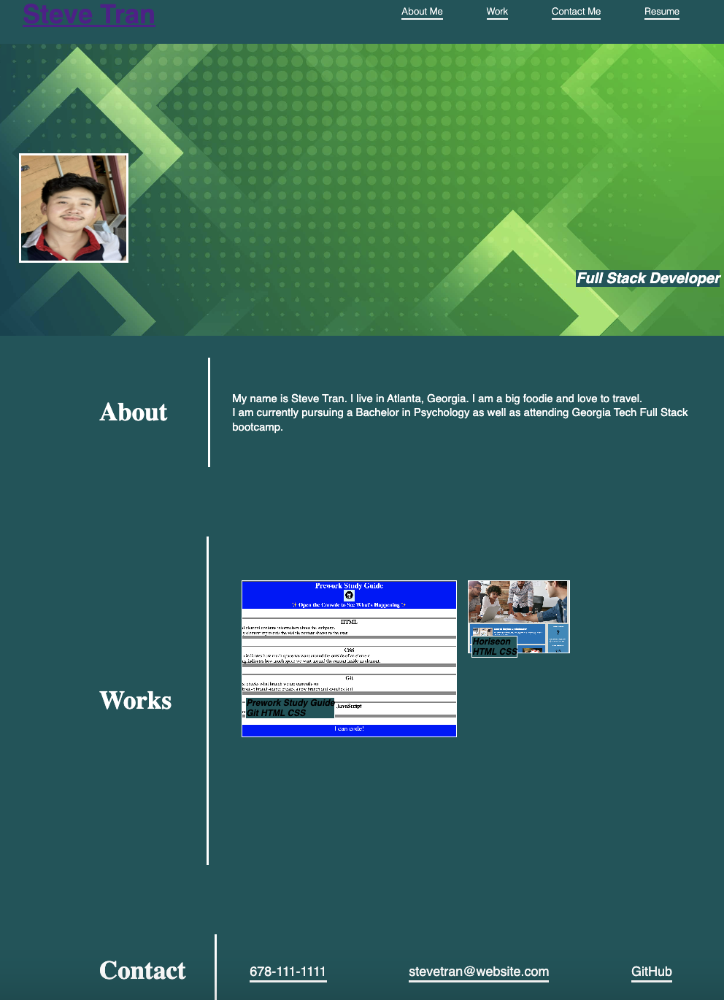

# Portfolio
## My Portfolio

To create a portfolio of work that showcase my skills and talents to employers looking to fill a part-time or full-time position. My portfolio will high my strongest work as well as my thought process behind it. My projects are deployed web applications.

 
 
### Acceptance Criteria:

- Portfolio contains potential employee's previous work.
- Portfolio presents developer's name, a recent photo, and links to about me, works, and contact info.
- UI scrolls to corresponding section when link in navigation is clicked.
- UI scrolls to a section with titled images of the developer's application when the link to the section about their work is clicked.
- Developers first application's image is larger in size than the others.
- Clicking the images of the application opens that deployed application
- Includes a responsive layout that adapt to different viewpoints when resizing the page or viewing the page on various secreens and device

[Deployed Application](https://stran0430.github.io/portfolio/)
